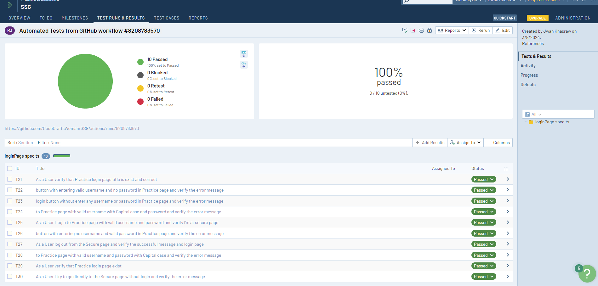
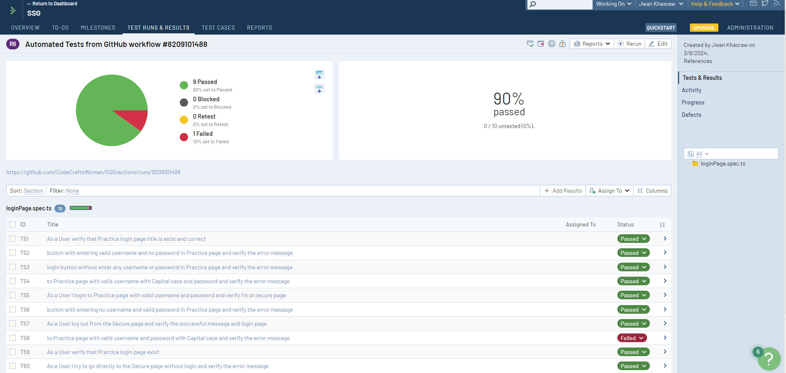

# Playwright UI Test Framework

To run tests in your local, make sure you have nodeJS

``` shell
npm install
npm run smoke-test
```

## Test Run on Github Actions
- Everyday at 5 AM
- Every push to main
- On demand

## Test Results go to the TestRail

### Passed Result



### Failed Result

